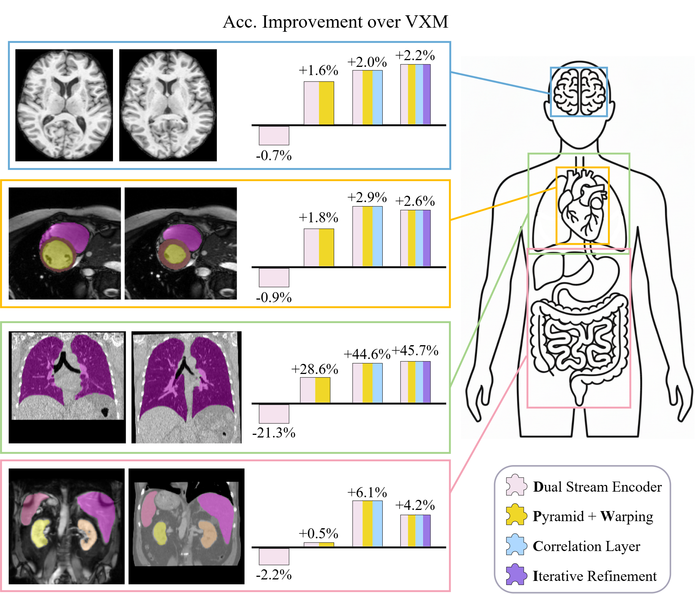
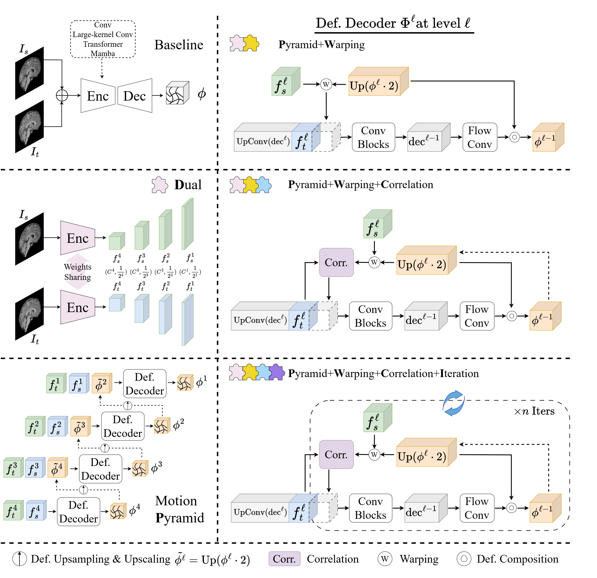

# Disentangling Architectural Progress in Medical Image Registration

**Beyond Off-the-Shelf Backbones towards Registration-Specific Strategies**

### Relevant papers

- [Disentangling Architectural Progress in Medical Image Registration (MedIA submission)](https://arxiv.org/html/2512.01913v1)
- [Mamba? Catch the Hype or Rethink What Really Helps for Image Registration (WBIR 2024)](https://link.springer.com/chapter/10.1007/978-3-031-73480-9_7)
- [Unleashing the Power of Intensity Augmentation for Multi-modal Image Registration (Medical Image Registration)](https://link.springer.com/chapter/10.1007/978-3-032-25169-5_6)

---

## TL;DR

Progress in learning-based registration is often credited to the newest off-the-shelf backbone. In practice, those backbones commonly arrive together with registration-specific changes—motion pyramids, feature warping, correlation volumes, and iterative refinement—so the two contributions remain entangled.

We separate these axes in a modular framework. Under the same training objective and protocol, backbone substitutions produce marginal or inconsistent gains, while registration-specific designs consistently improve accuracy, deformation regularity, and robustness across five registration tasks.





### Two axes

**Backbones:** VXM/CNN, TransMorph/Swin, Mamba/SSM, LKU-Net, and LessNet.

**Registration-specific designs:**

| Tag | Design | What it adds |
|---|---|---|
| **D** | Dual-stream encoder | Weight-shared source and target encoders |
| **WP** | Motion pyramid + warping | Coarse-to-fine flows and feature warping |
| **C** | Correlation volume | Local cost volume with radius `r=1` |
| **I** | Iterative refinement | Recursive decoder refinement, `num_iters=[1, 1, 2, 2]` coarse-to-fine |

The VXM-based progression is **Dual → DWP → DWCP → DWCPI**. The same decoder designs are also attached to LessNet and TransMorph encoders.

---

## Repository layout

```text
assets/                 paper overview figures
corr_cuda/              CUDA-based local-window correlation extension
models/
├── networks/           benchmark architectures and registration decoders
├── losses/             similarity and deformation losses
├── metrics/            overlap, surface, TRE, Jacobian, and NDV metrics
├── backbones/           alternative backbone implementations
├── flow_estimators/     alternative flow-estimator implementations
└── utils/               warping, registration heads, integration, building blocks
utils/
├── data/                one loader module per registration task
├── transforms/          MONAI-style data transforms
├── plotting/            flow, grid, segmentation, and error visualization
└── path_utils.py        `$DATA_ROOT` expansion
tasks/
├── brainmri/            train on LUMIR; evaluate on five zero-shot brain sets
├── lungct/              train on NLST; evaluate on NLST or Lung250M
├── cardiacmri/          train on ACDC; evaluate on ACDC or M&Ms
├── abdomenmrct/         paired MR–CT with translation/rigid pre-alignment
└── abdomenctct/         longitudinal CT–CT on PSMAReg
stress_test/
├── brainmri/            controlled translation and SVF stress evaluation
├── lungct/              NLST/Lung250M stress evaluation
└── stress_utils.py      shared synthetic-deformation implementation
```

Each task keeps a self-contained `train.py`, `run_iter.py`, `evaluate.py`, and `configs/`. Duplication between tasks is intentional: a reader can understand and run one task without following a shared training engine.

`models/backbones/`, `models/flow_estimators/`, `SVFIntegrateHead`, and the `MultiScaleRegistrationHead` alternatives are retained as working implementations. The shipped training path builds one `DownSizeRegistrationHead` per pyramid scale instead.

---

## Tasks and datasets

| Task | Directory | Train set | Evaluation sets | Image size | Similarity | λ |
|---|---|---|---|---|---|---|
| Cross-sectional brain MRI | [`tasks/brainmri`](tasks/brainmri) | LUMIR (500 scans) | OASIS, ADNI, IXI, LPBA, Mindboggle | 160×192×224 | LNCC, window 9 | 0.5 |
| Longitudinal lung CT | [`tasks/lungct`](tasks/lungct) | NLST | NLST, Lung250M-4B | 224×192×224 | LNCC, window 9 | 1.0 |
| Temporal cardiac MRI | [`tasks/cardiacmri`](tasks/cardiacmri) | ACDC (2D) | ACDC, M&Ms | 128×128 | MSE | 0.05 |
| Abdomen MRI–CT | [`tasks/abdomenmrct`](tasks/abdomenmrct) | one AbdomenMRCT half | the other half | 192×160×192 | MIND, `r=2`, `d=2` | 1.0 |
| Abdomen CT–CT | [`tasks/abdomenctct`](tasks/abdomenctct) | PSMAReg train split | PSMAReg val/test | 160×128×160 | LNCC, window 9 | 1.0 |

The common objective is

```text
L = L_sim + λ L_diffusion,     L_diffusion = ||∇u||².
```

Pyramid models apply this objective at the coarse levels using `scale_pyramid = [16, 8, 4]` with `scale_loss_weights = [1/16, 1/8, 1/4]`, plus the same objective at the final resolution weighted by `sim_loss_cfg.weight` (`1.0`). The remaining auxiliary loss weights in the paper setup are zero.

Common optimization settings are Adam at `1e-4`, exponential learning-rate decay `γ=0.996`, seed 2023, bidirectional training, and AMP fp16. The four 3D tasks estimate the final flow at half resolution and upsample it to the full grid (`spatial_scale=2.0` in the training `registration_cfg`). The merged evaluators reuse that saved registration configuration by default, preserving the released-checkpoint behavior; `--scale` overrides it when scoring a selected pyramid level. The abdomen `eval_cfg.py` files retain a `1.0` full-grid template, but the task evaluators intentionally replace it with the saved training configuration.

---

## Installation

Python 3.10 and a CUDA-enabled PyTorch installation are recommended.

```bash
conda create -n rethink-reg python=3.10 -y
conda activate rethink-reg

# Install a PyTorch build matching your CUDA toolkit first.
pip install torch==2.5.1 torchvision==0.20.1 \
  --index-url https://download.pytorch.org/whl/cu124
pip install -r requirements.txt
```

Mamba variants (`mam_vxm_cfg.py`, `mam_tm_cfg.py`) additionally require CUDA-compatible builds of `causal-conv1d` and `mamba-ssm`. They can be omitted when running the CNN, Transformer, LKU, or LessNet variants.

Training logs to Weights & Biases. For an offline or air-gapped run, set
`WANDB_MODE=offline` before invoking a trainer; the training code still keeps
local checkpoints and resolved configs under the task output directory.

### CUDA correlation extension

Correlation-based variants—DWCP, DWCPI, and their LessNet/TransMorph counterparts—can use the CUDA-based correlation implementation in `corr_cuda`:

```bash
pip install -e ./corr_cuda --no-build-isolation
```

`--no-build-isolation` is important because the extension must compile against the active PyTorch/CUDA build. See [`corr_cuda/README.md`](corr_cuda/README.md) for its API and benchmarks.

In a model config:

```python
corr_mode = 'cuda'    # CUDA-based implementation
corr_mode = 'for'     # low-memory pure-PyTorch fallback
corr_mode = 'einsum'  # vectorized PyTorch implementation
```

On the included benchmark cases, `cuda` is faster and uses less peak GPU memory
than both `for` and `einsum`. The exact improvement depends on the GPU, tensor
shape, radius, and padding mode. Use `for` when the CUDA extension is unavailable;
`einsum` is a vectorized alternative that requires substantially more memory.

### Data root

All input paths are expressed as `$DATA_ROOT/...` and expanded by `utils.resolve_path`:

```bash
export DATA_ROOT=/path/to/your/data
```

Expected dataset roots are:

```text
$DATA_ROOT/
├── LUMIR25/
├── OASIS/
├── ADNI_SEG/
├── IXI_data/
├── LPBA/
├── Mindboggle101/
├── NLST/
├── Lung250M-4B/
├── ACDC/
├── MM-Cardiac/
│   ├── All/
│   └── MMs_Dataset_info.csv
├── AbdomenMRCT/
└── PSMAReg/
    └── PSMAReg_CT_affine_crop160x128x160_FU01_no0359/
        └── PSMAReg_dataset.json
```

The cardiac task uses the included `tasks/cardiacmri/training.csv` and
`tasks/cardiacmri/testing.csv` manifests for the ACDC frame pairs. The M&Ms
loader expects the external `MMs_Dataset_info.csv` manifest and patient folders
under `MM-Cardiac/All/`; no M&Ms images are redistributed here.

The Abdomen CT–CT configs expect the preprocessed PSMAReg directory shown above;
`PSMAReg_dataset.json` supplies the image/label filenames and the task-local
`tasks/abdomenctct/dataset_split.json` supplies the train/validation/test subject
split. The public repository does not redistribute either medical-image dataset.
The data-loader modules document the remaining expected files and subdirectories.
Training outputs are written under the corresponding task directory unless
`out_path` is changed.

---

## Configs

The config filename identifies the architecture. Filenames are uniform across tasks where the method is available.

| Config | Method | Config | Method |
|---|---|---|---|
| `vxm_cfg.py` | VXM | `lessnet_cfg.py` | LessNet |
| `mam_vxm_cfg.py` | Mam-VXM | `less_dualpyd_cfg.py` | Less-DWP |
| `tm_cfg.py` | TM | `less_dwp_iter_cfg.py` | Less-DWPI |
| `mam_tm_cfg.py` | Mam-TM | `less_pwc_cfg.py` | Less-DWCP |
| `lku_cfg.py` | LKU | `less_pwc_iter_cfg.py` | Less-DWCPI† |
| `vxm_dual_cfg.py` | Dual | `tm_dual_cfg.py` | TM-Dual |
| `vxm_dualpyd_cfg.py` | DWP | `tm_dwp_cfg.py` | TM-DWP |
| `pwc_cfg.py` | **DWCP** | `tm_pwc_cfg.py` | TM-DWCP |
| `pwc_iter_cfg.py` | **DWCPI** | `tm_pwc_iter_cfg.py` | TM-DWCPI |

† Less-DWCPI is supplied for completeness but is not reported as a main paper result; the paper reports Less-DWPI because adding correlation does not help LessNet.

---

## Training

Run a task from its own directory so local `run_iter.py` imports and relative output paths resolve naturally:

```bash
# Brain MRI: LUMIR
cd tasks/brainmri
python train.py --train-config configs/pwc_cfg.py -seed 2023

# Lung CT: NLST
cd ../lungct
python train.py --train-config configs/pwc_iter_cfg.py -seed 2023

# Cardiac MRI: ACDC 2D
cd ../cardiacmri
python train.py --train-config configs/pwc_cfg.py -seed 2023

# Abdomen MR–CT: train on indices 9–16 using translation pre-alignment
cd ../abdomenmrct
python train.py --train-config configs/pwc_cfg.py -seed 2023 --split ts

# Abdomen CT–CT: PSMAReg
cd ../abdomenctct
python train.py --train-config configs/pwc_cfg.py -seed 2023
```

Every training script writes the resolved configuration to

```text
<out_path>/train_configs.py
```

alongside `<out_path>/saved_models/<epoch>.pth`. Evaluation reads `model_cfg` and `registration_cfg` back from this frozen file, so an architecture is never re-specified by hand at inference time.

### AbdomenMRCT split and pre-alignment

AbdomenMRCT contains two eight-pair halves with different label IDs:

| `--split` | Indices | Folders | Organ labels |
|---|---:|---|---|
| `tr` | 1–8 | `imagesTr/labelsTr` | `[1, 2, 3, 4]` |
| `ts` | 9–16 | `imagesTs/TSlabelsTs` | `[5, 2, 3, 1]` |

Train and evaluate on opposite halves. `train.py` defaults to `--split ts`; `evaluate.py` defaults to `--split tr`, reproducing the direction used by the released experiment setup.

The paper uses centroid **translation** pre-alignment. Add `--rigid` to retain the alternative gradient-optimized rigid pre-alignment. The flag must be the same during training and evaluation.

---

## Evaluation

### Brain MRI

```bash
cd tasks/brainmri
python evaluate.py -m ./pwc_outputs -exp 4 -epoch 100 --dataset oasis
python evaluate.py -m ./pwc_outputs -exp 4 -epoch 100 --dataset all
```

`--dataset` accepts `oasis`, `adni`, `ixi`, `lpba`, `mindboggle`, or `all`.

### Lung CT

```bash
cd tasks/lungct
python evaluate.py -m ./pwc_iter_outputs -exp 1 -epoch 200 --dataset nlst
python evaluate.py -m ./pwc_iter_outputs -exp 1 -epoch 200 --dataset lung250m
```

NLST reports landmark TRE and lung-mask metrics. Lung250M is the cross-dataset set and does not ship the same lung masks, so mask-derived metrics are omitted there.

### Cardiac MRI

```bash
cd tasks/cardiacmri
python evaluate.py -m ./pwc_outputs -exp 2 -epoch 200 --dataset acdc
python evaluate.py -m ./pwc_outputs -exp 2 -epoch 200 --dataset mms --image-size 128
```

### Abdomen MR–CT

```bash
cd tasks/abdomenmrct
python evaluate.py -m ./pwc_outputs -exp 0 -epoch 200 --split tr
```

The evaluator reports initial, pre-aligned, and deformably registered Dice, HD95, ASSD, and NSD per organ, plus Jacobian statistics.

### Abdomen CT–CT

```bash
cd tasks/abdomenctct
python evaluate.py -m ./pwc_outputs -exp 0 -epoch 200 --split test
```

PSMAReg organs absent from either scan are recorded as NaN rather than scored as zero.

### Progressive pyramid evaluation

Every task uses the same options instead of a separate `*_pyramid.py` script:

```bash
python evaluate.py ... --flow-idx 0 --scale 16
```

- `--flow-idx -1` selects the final model output and is the default used for headline results.
- `0` selects the coarsest flow.
- `--scale` overrides the registration-head upsampling factor for a coarse flow. Pass it together with `--flow-idx`, since a coarse flow is at `1/scale` resolution.
- Any non-default selection writes a suffixed file, so it does not overwrite final-flow metrics. The suffix records both flags, e.g. `--flow-idx 0 --scale 16` gives `_s16_f0` and a bare `--flow-idx 0` gives `_sNone_f0`.

Metrics implemented across tasks include DSC, HD95, ASSD, NSD, TRE, SD log-J, non-positive-Jacobian rate, and NDV. Labels and keypoints are used for evaluation or pre-alignment only, not as supervised deformation targets.

---

## Controlled stress tests

The manuscript stress tests cover brain MRI and lung CT. They synthesize either a known translation or a cubic B-spline stationary velocity field (SVF), then report registration accuracy, endpoint error, overlap, and deformation regularity.

```bash
# Brain MRI translation
python stress_test/brainmri/eval_stress.py \
  -m tasks/brainmri/pwc_iter_outputs -exp 7 -epoch 100 \
  --stress translation

# Lung CT SVF; choose NLST or Lung250M
python stress_test/lungct/eval_stress.py \
  -m tasks/lungct/pwc_iter_outputs -exp 1 -epoch 200 \
  --dataset nlst --stress svf
```

Omitting `--magnitudes` uses each script's built-in grid for the chosen `--stress` mode, which is what the manuscript reports; pass the flag only to override it.

Useful SVF controls include `--svf-coarse-size`, `--svf-smooth-sigma`, `--svf-int-steps`, `--svf-calibration-iters`, `--svf-calibration-stat {mean,p95,max}`, and `--svf-fg-smooth-sigma`. Their defaults are tuned per task and differ between the two scripts, so run `--help` before overriding them. Use `--max-cases` for a quick smoke test.

---

## Adding an architecture

Register a model in `models/networks/`:

```python
# models/networks/my_net.py
from ..builder import FLOW_ESTIMATORS

@FLOW_ESTIMATORS.register_module()
class MyNet(nn.Module):
    ...
```

Import the module from `models/networks/__init__.py`, then set
`model_cfg = dict(type='MyNet', ...)` in any task config. Importing `models` populates the registry automatically.

---

## Visualization

Reusable plotting and visualization helpers are included under `utils/plotting/` for
flow fields, deformed grids, segmentations, and error maps. They are independent
of the manuscript-generation scripts and can be used with new results.

---

## Citation

```bibtex
@article{jian2026disentangling,
  title   = {Disentangling Architectural Progress in Medical Image Registration:
             Beyond Off-the-Shelf Backbones towards Registration-Specific Strategies},
  author  = {Jian, Bailiang and Pan, Jiazhen and Jena, Rohit and Ghahremani, Morteza
             and Li, Hongwei Bran and Rueckert, Daniel and Wachinger, Christian
             and Wiestler, Benedikt},
  journal = {Medical Image Analysis},
  year    = {2026}
}
```

Learn2Reg Challenge 2025 paper:

```bibtex
@incollection{jian2025unleashing,
  title     = {Unleashing the Power of Intensity Augmentation for Multi-modal Image Registration},
  author    = {Jian, Bailiang and Scholz, Daniel and Pan, Jiazhen and Ghahremani, Morteza
               and Wachinger, Christian and Wiestler, Benedikt},
  booktitle = {International Challenge on Medical Image Registration},
  pages     = {43--51},
  year      = {2025},
  publisher = {Springer}
}
```

Earlier workshop version:

```bibtex
@inproceedings{jian2024mamba,
  title        = {Mamba? Catch The Hype Or Rethink What Really Helps for Image Registration},
  author       = {Jian, Bailiang and Pan, Jiazhen and Ghahremani, Morteza and Rueckert, Daniel
                   and Wachinger, Christian and Wiestler, Benedikt},
  booktitle    = {International Workshop on Biomedical Image Registration},
  pages        = {86--97},
  year         = {2024},
  organization = {Springer}
}
```

## Acknowledgements

This project builds on [VoxelMorph](https://github.com/voxelmorph/voxelmorph), [TransMorph](https://github.com/junyuchen245/TransMorph_Transformer_for_Medical_Image_Registration), [LKU-Net](https://github.com/xi-jia/LKU-Net), [Mamba](https://github.com/state-spaces/mamba), [MONAI](https://github.com/Project-MONAI/MONAI), and [MMEngine](https://github.com/open-mmlab/mmengine). `models/metrics/surface_distance/` is based on [DeepMind surface-distance](https://github.com/google-deepmind/surface-distance) (Apache-2.0).

## License

© Bailiang Jian. Licensed under the [MIT License](LICENSE).
