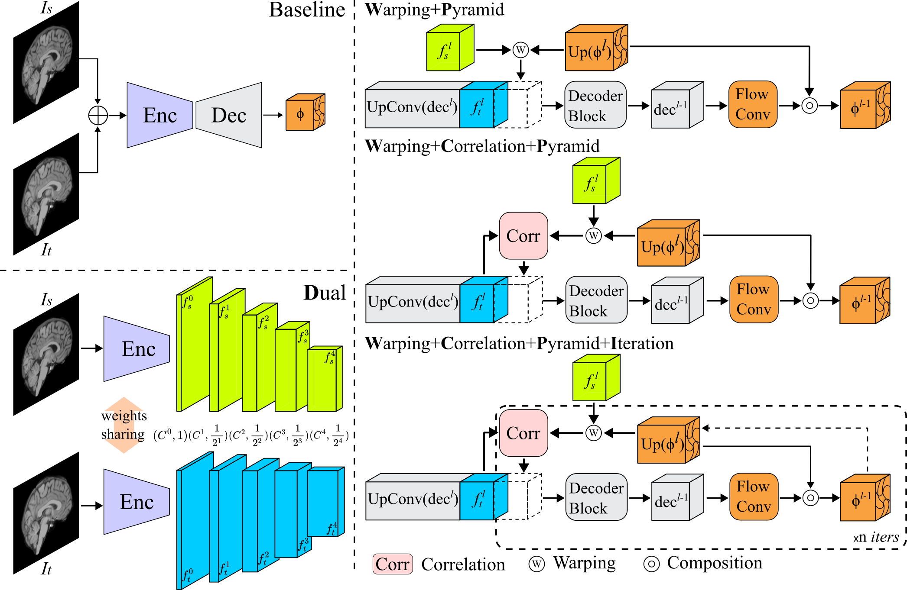

# Mamba? Catch the Hype or Rethink What Really Helps for Image Registration

This is the official Pytorch implementation of the paper @MICCAI2024@WBIR2024:
["Mamba? Catch the Hype or Rethink What Really Helps for Image Registration (WBIR2024)"](https://arxiv.org/abs/2407.19274)

---

## TODOs
- [x] Upload networks code
- [ ] Upload configuration files
  - [x] Upload network configuration files
  - [ ] Upload data configuration files
  - [ ] Upload training configuration files
- [ ] Upload training and inference scripts
- [ ] Upload pretrained model weights
- [ ] Update README.md

---

## Low-level Computational Blocks
- CNN ([VoxelMorph](https://github.com/voxelmorph/voxelmorph))
- Transformer ([TransMorph](https://github.com/junyuchen245/TransMorph_Transformer_for_Medical_Image_Registration/))
- Large-Kernel CNN ([LKU-Net](https://github.com/xi-jia/LKU-Net))
- Mamba ([MambaMorph](https://github.com/Guo-Stone/MambaMorph))
---

## High-level Registration-specific Designs

- Dual Stream Encoders
- Motion Pyramid and Warping
- Correlation Layers
- Iterative Optimization
---

## Dataset
### Training
- OASIS
- ADNI
- IXI
### Zero-shot Evaluation
- LPBA
- MindBoggle
---

## Pretrained Model

---

---

## Prerequisites

---

## Training

---

## Inference

---

## Citation

If you find this repository useful in your research, please consider to cite use in your work by:

```

```

---

## Acknowledgement

Many thanks to the following repositories for providing helpful resources to my work:

- [VoxelMorph](https://github.com/voxelmorph/voxelmorph)
- [TransMorph](https://github.com/junyuchen245/TransMorph_Transformer_for_Medical_Image_Registration)
- [SegMamba](https://github.com/ge-xing/SegMamba)
- [UMamba](https://github.com/bowang-lab/U-Mamba)
- [MONAI](https://github.com/Project-MONAI/MONAI)
- [MMCV](https://github.com/open-mmlab/mmcv)

---

## Lincense & Copyright

© Bailiang Jian
Licensed under the [MIT Licensce](LICENSCE)